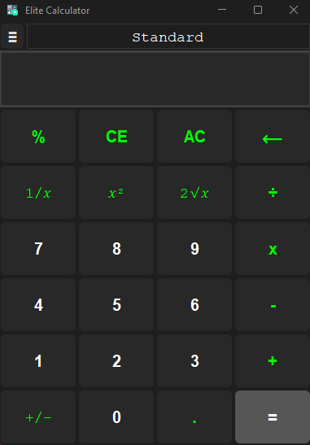
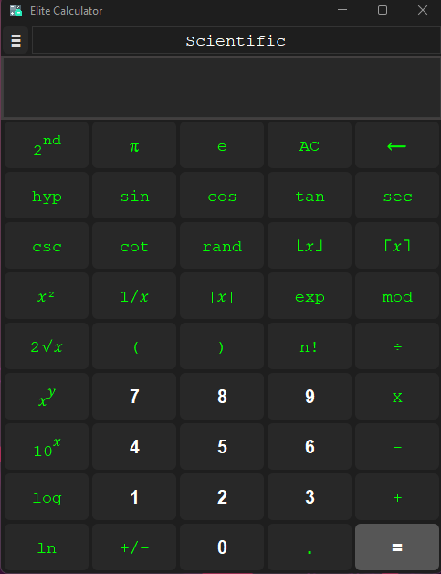
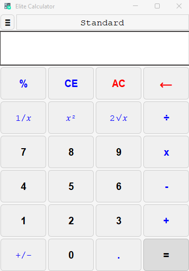
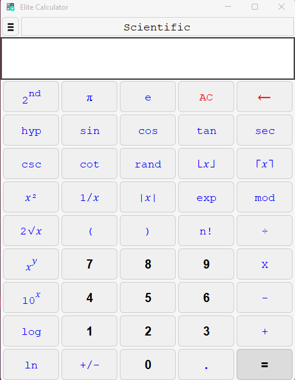

<p align="center">
  
</p>

<h1 align="center">
  Elite Calculator
</h1>

<p align="center">
  Elite Calculator is a lightweight and versatile calculator app for students and professionals.
</p>

<p align="center">
  <a style="text-decoration:none" href="https://apps.microsoft.com/detail/9pcn88z0l6hn?hl=en-GB&gl=IN">
    
  </a>
  <a style="text-decoration:none" href="https://github.com/raghul-tech/Elite-Calculator/releases">
    
  </a>
  <a style="text-decoration:none">
    
  </a>
  <a style="text-decoration:none" href="https://discord.gg/cdBT2KrE2D">
    
  </a>
</p>

<p align="center">
  <a style="text-decoration:none" href="https://raghul-tech.itch.io/elite-calculator">
    
  </a>
  <a style="text-decoration:none" href="https://sourceforge.net/projects/elite-calculator/">
    
  </a>
</p>

<p align="center">
  <a href="https://buymeacoffee.com/raghultech">
    
  </a>
</p>

---

## Description
Elite Calculator is designed for simplicity and performance. It offers a clean interface and advanced features to meet the needs of students, professionals, and developers alike. Whether you need basic arithmetic operations or complex scientific calculations, Elite Calculator has you covered.

---

## Features
- **Basic Arithmetic**: Perform addition, subtraction, multiplication, and division effortlessly.
- **Scientific Functions**: Includes trigonometry, logarithmic, and exponential calculations.
- **User-Friendly Interface**: Minimalistic design for intuitive usage.
- **Cross-Platform**: Available on Windows and Linux.
- **Lightweight**: Runs smoothly without consuming excessive system resources.

---

## Screenshots
<p align="center">
  
</p>
<p align="center">
  
</p>
<p align="center">
  
</p>
<p align="center">
  
</p>

---


# Installation

### From Microsoft Store
1. Visit the [Microsoft Store](https://apps.microsoft.com/detail/9pcn88z0l6hn?hl=en-GB&gl=IN).
2. Click "Install" to download and use the application.

    <a href="https://apps.microsoft.com/detail/9pcn88z0l6hn?launch=true&mode=mini" target="_blank" rel="noopener noreferrer">
       
    </a>

### From itch.io
1. Go to [itch.io](https://raghul-tech.itch.io/elite-calculator).
2. Download the application and follow the setup instructions.

    <a href="https://raghul-tech.itch.io/elite-calculator" target="_blank" rel="noopener noreferrer">
      
    </a>

### From SourceForge
1. Navigate to [SourceForge](https://sourceforge.net/projects/elite-calculator/).
2. Download the installer compatible with your operating system.

<a href="https://sourceforge.net/projects/elite-calculator/files/latest/download"></a>

Elite Calculator is available for **Windows** and **Linux**.


---


# How to Download and Install

## For Windows
1. **From Microsoft Store**  
   - Download the installer from the [Microsoft Store](https://apps.microsoft.com/detail/9pcn88z0l6hn?hl=en-GB&gl=IN).  
   - Run the installer, and it will redirect you to the Microsoft Store to complete the installation.

2. **Using Winget**  
   - Open Command Prompt or PowerShell.  
   - Run the following command to install Elite Calculator:  
     ```bash
     winget install "Elite Calculator"
     ```

---

## For Linux
1. **Download the `.tar.gz` File**  
   - Visit [SourceForge](https://sourceforge.net/projects/elite-calculator/files/latest/download) or [itch.io](https://raghul-tech.itch.io/elite-calculator) and download the Linux version of the `.tar.gz` file:  
     **Elite CalculatorV1.0.0-Installer(linux).tar.gz**

2. **Extract the File**  
   - Open a terminal and navigate to the directory where the `.tar.gz` file was downloaded.
   - Use the following command to extract the file:  
     ```bash
     tar -xvzf "Elite CalculatorV1.0.0-Installer(linux).tar.gz"
     ```

3. **Make the Installer Executable**  
   - Navigate to the extracted folder:  
     ```bash
     cd "Elite CalculatorV1.0.0-Installer(linux)"
     ```
   - Run the following command to make the `install.sh` script executable:  
     ```bash
     chmod +x install.sh
     ```

4. **Run the Installer**  
   - Execute the installer with this command:  
     ```bash
     ./install.sh
     ```
   - This will create shortcuts in your desktop and menubar for easy access.


---

## Changelog
Stay updated with the latest improvements and features. Check the [Changelog](changelog.md) for details about each version.

---

## Privacy Policy
We value your privacy. Read our [Privacy Policy](privacy-policy.md) for more information.

---

## Skill Demonstration
Elite Calculator demonstrates proficiency in:  
- UI/UX Design  
- Cross-Platform Development  
- Performance Optimization  
- Error Handling and Debugging

---

## Why Choose Elite Calculator?
- **Lightweight and Fast**: No lag or unnecessary features.
- **Modern Design**: Aesthetic and functional interface.
- **Highly Compatible**: Works seamlessly on multiple platforms.
- **Regular Updates**: Continuously improved with user feedback.

---

## How to Contribute
Contributions are welcome! Follow these steps:
1. Fork the repository.
2. Create a feature branch (`git checkout -b feature-name`).
3. Commit your changes (`git commit -m "Add feature"`).
4. Push to the branch (`git push origin feature-name`).
5. Open a Pull Request.

* If you like my work, please consider:
   * Star this project on GitHub
   * Leave me a review [here](https://apps.microsoft.com/detail/9pcn88z0l6hn?hl=en-GB&gl=IN)
   * [](https://buymeacoffee.com/raghultech)
   *  If you’re interested in contributing, please [contact me](mailto:raghultech.app@gmail.com) or submit an pull request.	

---

## Report a Bug
   * If you've encountered a bug, please report it by clicking the link below. 
   	This will guide you through the bug-reporting process:
   	[Click here to report a bug](https://github.com/raghul-tech/Elite-Calculator/issues/new?template=bug_report.md)

---

## Contact
For inquiries, reach out via email at **raghultech.app@gmail.com**.

Stay tuned for updates and discussions on our [Discord Server](https://discord.gg/cdBT2KrE2D).

---

Thank you for choosing Elite Calculator!